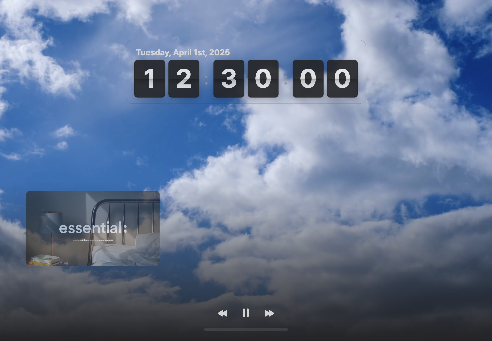
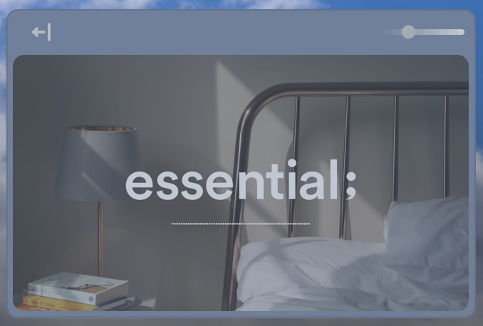
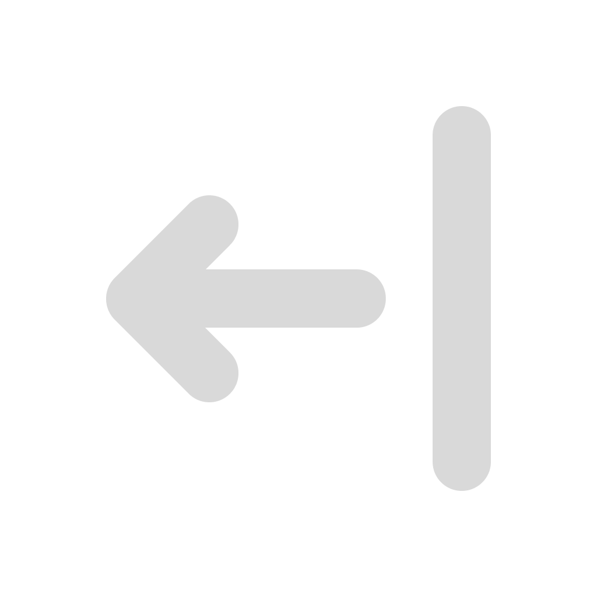
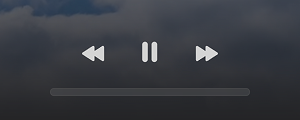
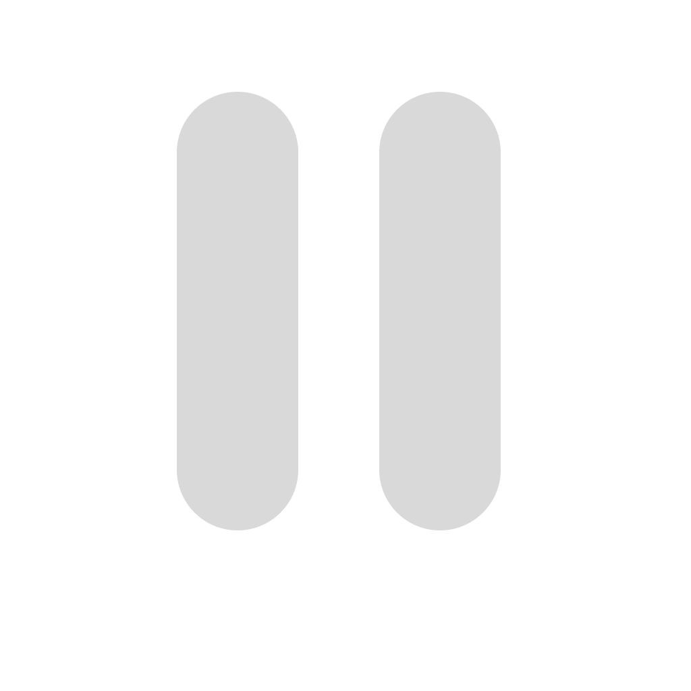
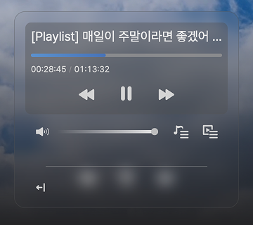
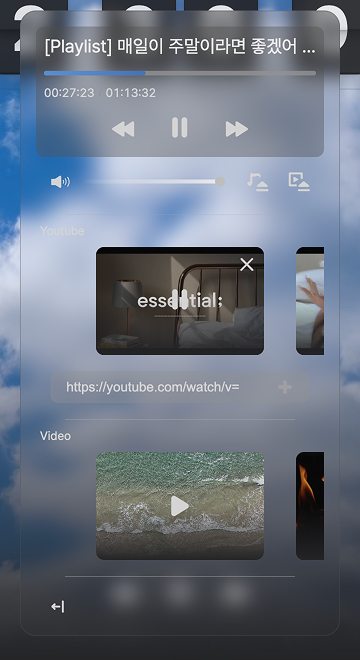

# Flipco
https://flipco.jeonhui.com


```text
A simple and aesthetic webpage
that displays a flip clock 
and features an embedded YouTube playlist for background music.
```





--- 

## Features

### youtube video player



**Feature**

- **hide**  () & **show** ()
- **control opacity** with slider
- **resize** & **move** the player

<br/>

### youtube video controller



**Feature**

- **play** () & **pause** ()
- **next** () & **previous** ()

<br/>

### control panel
It can be used by hovering on the bar under the controller



**Feature**

- **play** () & **pause** ()
- **next** () & **previous** ()
- playback **seek** with a slider
- **control volume** with slider

**youtube list & background video list**



- select **youtube video** from the list
- add & delete **youtube video** from the list
- select **background video** from the list


<br/>

---

### Tech Stack:

**Frontend**: React, Next.js

**Styling**: CSS Modules, Vanilla Extract CSS

**Other Tools**: TypeScript, ESLint

<br/>

### Key Info:

**Website**: https://flipco.jeonhui.com

**Version**: 1.0.0

**Technologies Used**: React, Next.js, TypeScript, ESLint, and more

<br/>

---

<br/>

### Contact:

l06094@gmail.com